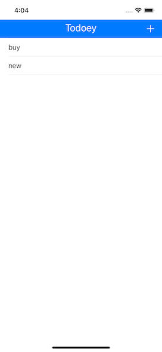
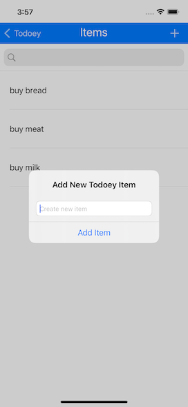

# Todoey ✓

## What skills I used

* integrated third party libraries in app using Cocoapods and Swift Package Manager.
* data in Realm database.
* made query and sort the database.
* worked with UITableViews and how to set their data sources and delegates.

# To bild:
- clone the repo
- install cocoaPods
- install Realm
- launch Todoey.xcworkspace

